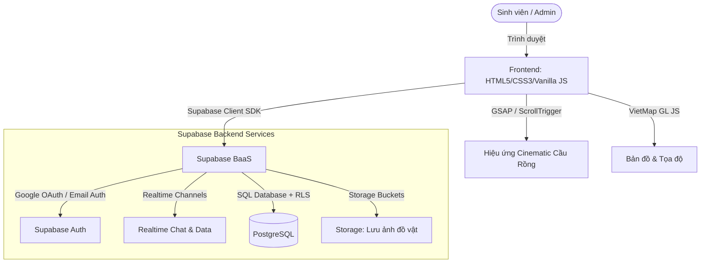

# BÁO CÁO THUYET TRÌNH ĐỒ ÁN CUỐI KỲ: ĐN-UniShare Web
**Môn học:** Công nghệ Web (Web Technology)
**Đề tài:** Nền tảng chia sẻ đồ dùng học tập cho sinh viên Làng Đại học Đà Nẵng
**Công nghệ sử dụng:** HTML5, CSS3, Vanilla JS (ES Modules), Supabase BaaS (Database, Auth, Storage, Realtime, RLS), VietMap API (Bản đồ), GSAP (Cinematic Scroll Effect)

---

## I. TỔNG QUAN DỰ ÁN & ĐỘNG LỰC PHÁT TRIỂN
* **Vấn đề thực tế:** Sinh viên Làng Đại học Đà Nẵng thường xuyên có nhu cầu thanh lý, tặng, trao đổi đồ dùng học tập cũ (giáo trình, tài liệu, đồ dùng KTX,...) hoặc tìm kiếm đồ thất lạc. Tuy nhiên, các group Facebook/Zalo bị trôi bài nhanh, không có tính năng lọc theo vị trí và không kiểm soát được đối tượng tham gia.
* **Giải pháp: ĐN-UniShare Web** là nền tảng web chuyên biệt giúp sinh viên kết nối, trao đổi đồ dùng trực quan qua bản đồ địa lý, chat realtime, và được quản trị viên (Admin) duyệt bài để đảm bảo chất lượng thông tin.
* **Điểm nhấn công nghệ:** 
  1. Hạn chế đăng ký chỉ cho email sinh viên các trường thuộc Đại học Đà Nẵng (DUT, DUE, UED, VKU,...) qua Google OAuth.
  2. Tích hợp bản đồ VietMap GL JS thuần trên nền tối (Dark mode) sang trọng.
  3. Hiệu ứng cuộn màn hình Cinematic (Dragon Bridge canvas scroll) mượt mà tối ưu hiệu năng bằng GSAP.
  4. Hệ thống cơ sở dữ liệu thời gian thực (Realtime) hoàn toàn bảo mật bằng RLS (Row Level Security).

---

## II. KIẾN TRÚC HỆ THỐNG & TECH STACK



---

## III. THIẾT KẾ CƠ SỞ DỮ LIỆU (DATABASE SCHEMA)
Hệ thống sử dụng **PostgreSQL** được lưu trữ trên Supabase với các bảng chính:

### 1. Bảng `users` (Thông tin người dùng)
* Lưu thông tin đồng bộ từ Google OAuth hoặc tài khoản Admin.
```sql
CREATE TABLE public.users (
  id UUID PRIMARY KEY REFERENCES auth.users(id) ON DELETE CASCADE,
  email TEXT UNIQUE NOT NULL,
  name TEXT NOT NULL,
  avatar TEXT,
  faculty TEXT NOT NULL DEFAULT 'Khác',
  role TEXT NOT NULL DEFAULT 'user' CHECK (role IN ('user', 'admin')),
  rating_avg DECIMAL(2,1) DEFAULT 0,
  rating_count INTEGER DEFAULT 0,
  created_at TIMESTAMPTZ DEFAULT NOW()
);
```

### 2. Bảng `items` (Đồ dùng chia sẻ)
* Lưu trữ tin đăng với 4 loại hình (`mienphi` - Tặng, `traodoi` - Trao đổi, `sale` - Bán rẻ, `lost` - Tìm đồ). Trạng thái mặc định là `pending` chờ Admin duyệt.
```sql
CREATE TABLE public.items (
  id UUID PRIMARY KEY DEFAULT uuid_generate_v4(),
  title TEXT NOT NULL,
  description TEXT NOT NULL,
  category TEXT NOT NULL CHECK (category IN ('sach', 'do-hoc-tap', 'do-ktx', 'suatan', 'tailieu', 'khac')),
  condition TEXT NOT NULL CHECK (condition IN ('moi', 'tot', 'kha', 'cu')),
  exchange_type TEXT NOT NULL DEFAULT 'mienphi' CHECK (exchange_type IN ('mienphi', 'traodoi', 'sale', 'lost')),
  image TEXT NOT NULL DEFAULT '',
  location TEXT NOT NULL, -- Tên vị trí (Ví dụ: KTX Làng Đại học)
  posted_by TEXT NOT NULL,
  poster_id UUID NOT NULL REFERENCES public.users(id) ON DELETE CASCADE,
  status TEXT NOT NULL DEFAULT 'pending' CHECK (status IN ('pending', 'available', 'reserved', 'completed', 'cancelled', 'rejected')),
  price NUMERIC,
  latitude DOUBLE PRECISION,
  longitude DOUBLE PRECISION,
  created_at TIMESTAMPTZ DEFAULT NOW()
);
```

### 3. Bảng `requests` (Yêu cầu nhận đồ)
* Quản lý các yêu cầu nhận đồ giữa sinh viên và chủ bài đăng.
```sql
CREATE TABLE public.requests (
  id UUID PRIMARY KEY DEFAULT uuid_generate_v4(),
  item_id UUID NOT NULL REFERENCES public.items(id) ON DELETE CASCADE,
  requester_id UUID NOT NULL REFERENCES public.users(id) ON DELETE CASCADE,
  status TEXT NOT NULL DEFAULT 'pending' CHECK (status IN ('pending', 'accepted', 'rejected', 'collected')),
  UNIQUE(item_id, requester_id)
);
```

### 4. Hệ thống Chat (`conversations` & `messages`)
* Lưu trữ phòng chat và tin nhắn realtime giữa các sinh viên trao đổi.

---

## IV. CÁC TÍNH NĂNG CHÍNH & GIẢI THÍCH CHI TIẾT CODE MẪU

### Chức năng 1: Xác thực bằng Google OAuth & Hạn chế tên miền trường học
* **Ý nghĩa:** Tránh việc tài khoản ngoài trường vào đăng tin spam. Chỉ những email sinh viên có đuôi quy định mới được vào hệ thống.
* **Code chi tiết trong [js/auth.js](file:///e:/ĐN-UniShare/ĐN-UniShare/dn-unishare-web/js/auth.js):**
```javascript
// Danh sách domain hợp lệ trong js/constants.js
export const ALLOWED_EMAIL_DOMAINS = [
  'sv1.dut.udn.vn', 'sv2.dut.udn.vn', 'due.edu.vn', 'ued.udn.vn', 'udn.vn'
];

// Hàm kiểm tra khi callback từ Google OAuth thành công
export async function handleOAuthCallback() {
  const { data: { session } } = await supabase.auth.getSession();
  const email = session.user.email;
  
  // Kiểm tra đuôi email sinh viên
  if (!isAllowedStudentEmail(email)) {
    await supabase.auth.signOut(); // Đăng xuất ngay nếu không hợp lệ
    throw new Error(`Email ${email} không thuộc trường được phép.`);
  }
  await ensureUserProfile(session.user);
  return session;
}
```
* **Trigger tự động trong Database [supabase/schema.sql](file:///e:/ĐN-UniShare/ĐN-UniShare/dn-unishare-web/supabase/schema.sql):**
Tự động đồng bộ thông tin và đoán Khoa/Trường dựa trên email ngay khi user mới đăng ký:
```sql
CREATE OR REPLACE FUNCTION public.infer_faculty(email TEXT)
RETURNS TEXT AS $$
BEGIN
  IF email LIKE '%dut%' THEN RETURN 'CNTT - ĐH Bách Khoa';
  ELSIF email LIKE '%due%' THEN RETURN 'Quản trị KD - ĐH Kinh tế';
  ELSIF email LIKE '%ued%' THEN RETURN 'Sư phạm Toán - ĐH Sư phạm';
  ELSE RETURN 'Khác';
  END IF;
END;
$$ LANGUAGE plpgsql;
```

---

### Chức năng 2: Định vị và Bản đồ VietMap GL JS
* **Ý nghĩa:** Cho phép sinh viên ghim tọa độ chính xác của món đồ cần tặng hoặc vị trí thất lạc trên bản đồ tối màu sang trọng.
* **Code chi tiết trong [js/vietmap.js](file:///e:/ĐN-UniShare/ĐN-UniShare/dn-unishare-web/js/vietmap.js):**
```javascript
export async function initMapPicker(container, options = {}) {
  const vm = await loadVietMap(); // Nạp thư viện động từ CDN
  const map = new vm.Map({
    container: container,
    style: styleUrl(), // VietMap API Key style hoặc Carto Dark Matter style làm fallback
    center: [options.lng, options.lat],
    zoom: 15
  });

  let marker = new vm.Marker({ element: pinEl('#ef4444'), draggable: true })
    .setLngLat([options.lng, options.lat])
    .addTo(map);

  // Lắng nghe sự kiện click trên bản đồ để cập nhật tọa độ
  map.on('click', (e) => {
    marker.setLngLat([e.lngLat.lng, e.lngLat.lat]);
    options.onCoordsChange?.(e.lngLat.lat, e.lngLat.lng);
  });
}
```

---

### Chức năng 3: Tìm đồ quanh đây (Tính khoảng cách bằng Công thức Haversine)
* **Ý nghĩa:** Tính khoảng cách địa lý theo đường chim bay từ tọa độ người dùng đến tọa độ ghim trên các bài đăng. Chỉ hiển thị những món đồ nằm trong bán kính **1.5km**.
* **Công thức toán học Haversine:**
$$d = 2R \arcsin\left(\sqrt{\sin^2\left(\frac{\Delta\varphi}{2}\right) + \cos(\varphi_1)\cos(\varphi_2)\sin^2\left(\frac{\Delta\lambda}{2}\right)}\right)$$
Trong đó $\varphi$ là vĩ độ, $\lambda$ là kinh độ, $R$ là bán kính Trái Đất ($6371000m$).
* **Code chi tiết trong [js/constants.js](file:///e:/ĐN-UniShare/ĐN-UniShare/dn-unishare-web/js/constants.js) và [js/nearby.js](file:///e:/ĐN-UniShare/ĐN-UniShare/dn-unishare-web/js/nearby.js):**
```javascript
// Tính khoảng cách giữa 2 tọa độ (m)
export function getDistance(lat1, lon1, lat2, lon2) {
  const R = 6371000; // Bán kính Trái Đất (mét)
  const dLat = (lat2 - lat1) * Math.PI / 180;
  const dLon = (lon2 - lon1) * Math.PI / 180;
  const a = Math.sin(dLat / 2) ** 2 +
            Math.cos(lat1 * Math.PI / 180) * Math.cos(lat2 * Math.PI / 180) * 
            Math.sin(dLon / 2) ** 2;
  return R * 2 * Math.atan2(Math.sqrt(a), Math.sqrt(1 - a));
}

// Lọc và xếp hạng các tin đăng gần nhất
export function rankNearbyItems(items, center, options = {}) {
  const maxRange = options.maxRange ?? 1500; // Mặc định 1.5km
  return items
    .map((item, idx) => {
      const coords = getPosterCoords(item, idx);
      const distance = getDistance(center.lat, center.lng, coords.lat, coords.lng);
      return { ...item, distance };
    })
    .filter((item) => item.distance <= maxRange)
    .sort((a, b) => a.distance - b.distance); // Sắp xếp từ gần đến xa
}
```

---

### Chức năng 4: Realtime Chat bằng Supabase WebSockets Channel
* **Ý nghĩa:** Sinh viên có thể thương lượng xin đồ, trao đổi ngay lập tức. Tin nhắn hiển thị tức thì mà không cần reload trang nhờ kết nối WebSockets của Supabase.
* **Code chi tiết đăng ký kênh Realtime trong [js/chat.js](file:///e:/ĐN-UniShare/ĐN-UniShare/dn-unishare-web/js/chat.js):**
```javascript
export function subscribeMessages(conversationId, onMessage) {
  return supabase
    .channel(`messages:${conversationId}`) // Tạo kênh chat riêng theo ID phòng
    .on('postgres_changes', {
      event: 'INSERT', 
      schema: 'public', 
      table: 'messages',
      filter: `conversation_id=eq.${conversationId}`, // Chỉ nhận tin của phòng này
    }, (payload) => {
      onMessage(payload.new); // Gọi callback render giao diện khi có tin mới
    })
    .subscribe();
}
```

---

### Chức năng 5: Hiệu ứng Cuộn Màn hình Cinematic Cầu Rồng (Canvas + GSAP)
* **Ý nghĩa:** Wow giảng viên ngay từ giây đầu tiên truy cập trang chủ bằng hiệu ứng chuyển động mượt mà của Cầu Rồng Đà Nẵng theo tốc độ cuộn chuột (Scroll).
* **Cơ chế:** Load trước **192 khung ảnh** tuần tự. Khi người dùng cuộn trang, thư viện `GSAP ScrollTrigger` sẽ tính tỷ lệ cuộn chuột từ $0 \to 1$, nội suy ra chỉ số ảnh tương ứng để vẽ trực tiếp lên thẻ `<canvas>` bằng phương thức `ctx.drawImage()`. Điều này tránh giật lag so với việc dùng thẻ `<video>` hoặc thay đổi thuộc tính CSS `background`.
* **Code chi tiết trong [js/home-cinematic.js](file:///e:/ĐN-UniShare/ĐN-UniShare/dn-unishare-web/js/home-cinematic.js):**
```javascript
// Preload 192 ảnh Cầu Rồng vào bộ nhớ đệm
function preloadFrames() {
  const images = [];
  for (let i = 0; i < 192; i++) {
    const img = new Image();
    img.src = `assets/images/hero-frames/frame-${String(i + 1).padStart(3, '0')}.jpg`;
    images.push(img);
  }
  return images;
}

// Đồng bộ hóa vị trí cuộn chuột với khung hình Canvas qua GSAP
ScrollTrigger.create({
  trigger: '#cinematic-page',
  start: 'top top',
  end: 'bottom bottom',
  onUpdate: (self) => {
    targetProgress = self.progress; // Nhận tiến trình cuộn từ 0.0 đến 1.0
  }
});

// Hàm tick lặp liên tục để vẽ chuyển động mượt mà (Linear Interpolation - LERP)
const tick = () => {
  smoothProgress += (targetProgress - smoothProgress) * 0.08; // LERP 8% cho chuyển động mượt
  const frameIndex = Math.round(smoothProgress * 191);
  ctx.drawImage(images[frameIndex], 0, 0, 1280, 720);
};
gsap.ticker.add(tick); // Lồng vào ticker của GSAP tối ưu tốc độ vẽ (requestAnimationFrame)
```

---

## V. CƠ CHẾ BẢO MẬT: ROW LEVEL SECURITY (RLS)
Hệ thống KHÔNG dựa hoàn toàn vào việc bảo mật ở Frontend. Trong DB Supabase, tất cả các bảng đều được bật RLS nhằm đảm bảo người dùng chỉ thao tác được dữ liệu của chính mình:
* **Bảng `users`**: Bất kỳ ai cũng có thể đọc profile của sinh viên khác (để xem uy tín), nhưng chỉ chính sinh viên đó mới được cập nhật thông tin cá nhân.
  ```sql
  CREATE POLICY "users_update_own" ON public.users 
  FOR UPDATE USING (id = auth.uid());
  ```
* **Bảng `items` (Đồ dùng)**: Sinh viên chỉ được chỉnh sửa/xóa bài đăng của chính họ. Quản trị viên (Admin) có quyền đặc biệt để phê duyệt/từ chối trạng thái bài đăng.
  ```sql
  CREATE POLICY "items_update_own" ON public.items 
  FOR UPDATE USING (poster_id = auth.uid());
  
  CREATE POLICY "items_admin_update" ON public.items 
  FOR UPDATE USING (
    EXISTS (SELECT 1 FROM public.users WHERE id = auth.uid() AND role = 'admin')
  );
  ```

---

## VI. BỘ CÂU HỎI & TRẢ LỜI PHẢN BIỆN THƯỜNG GẶP (FAQ) CHO BUỔI THUYẾT TRÌNH

### 1. Tại sao em lại chọn Vanilla JS (JS thuần) thay vì React/Next.js?
* **Trả lời:** Em sử dụng **Vanilla JS (ES Modules)** kết hợp với cấu trúc file tổ chức tốt nhằm thể hiện khả năng làm việc vững chắc với nền tảng cốt lõi của công nghệ Web (DOM Manipulation, Native Fetch API, ES Modules). Dự án tối ưu hóa kích thước file tải về (dưới 100KB mã nguồn), không cần build phức tạp, giúp trang tải cực kỳ nhanh mà vẫn đảm bảo tính module hóa và bảo trì dễ dàng.

### 2. Dữ liệu realtime của tính năng Chat hoạt động thế nào? Có tốn tài nguyên server không?
* **Trả lời:** Tính năng chat sử dụng cơ chế **PostgreSQL Realtime** thông qua kênh **WebSockets** của Supabase. Khi có tin nhắn mới được `INSERT` vào bảng `messages` trên database, PostgreSQL sẽ phát ra một sự kiện thay đổi. Supabase client lắng nghe qua kết nối WebSocket duy nhất đã được thiết lập và cập nhật giao diện mà không cần cơ chế pull-polling (gửi yêu cầu liên tục tới server), nhờ đó tiết kiệm băng thông và tối ưu tài nguyên tối đa.

### 3. Phân biệt quyền giữa Sinh viên (User) và Admin như thế nào?
* **Trả lời:** Em phân quyền dựa trên cột `role` trong bảng `users` (`'user'` hoặc `'admin'`). 
  - Sinh viên chỉ đăng nhập bằng Google OAuth để đảm bảo đúng email trường. 
  - Admin đăng nhập bằng Email/Password thông qua trang quản trị riêng. Khi Admin duyệt bài, hệ thống thực thi chính sách RLS nâng cao trên database: RLS sẽ kiểm tra xem `auth.uid()` hiện tại có vai trò `admin` trong bảng `users` hay không trước khi cho phép thực hiện lệnh `UPDATE` trên bảng `items`.

### 4. Công thức Haversine để tính khoảng cách có nhược điểm gì và giải quyết ra sao?
* **Trả lời:** Công thức Haversine tính khoảng cách theo đường chim bay giữa hai cặp tọa độ trên mặt cầu Trái Đất. Nhược điểm của nó là không phản ánh chính xác quãng đường di chuyển thực tế bằng đường bộ. Tuy nhiên, đối với khu vực Làng Đại học có diện tích nhỏ (bán kính dưới 2km) và sinh viên chủ yếu đi bộ hoặc xe máy, khoảng cách đường chim bay phản ánh tương đối chính xác thời gian tiếp cận đồ dùng. Điều này cũng giúp thuật toán chạy cực kỳ nhanh ngay tại Client mà không cần gọi API tính đường đi tốn phí từ Google Maps hay VietMap.

### 5. Dự án xử lý lưu trữ ảnh thế nào để không bị quá tải DB?
* **Trả lời:** Dữ liệu hình ảnh được lưu trữ tại **Supabase Storage (Object Storage)** dưới dạng các file nhị phân. Cơ sở dữ liệu PostgreSQL chỉ lưu trữ đường dẫn URL trỏ đến ảnh đó. Đồng thời, chính sách RLS của Storage Bucket chỉ cho phép người dùng đã xác thực (`authenticated`) được phép tải ảnh lên, tránh việc người ngoài lợi dụng upload các file dung lượng lớn phá hoại hệ thống.

---
Chúc bạn có một buổi bảo vệ đồ án thành công rực rỡ! 🚀
